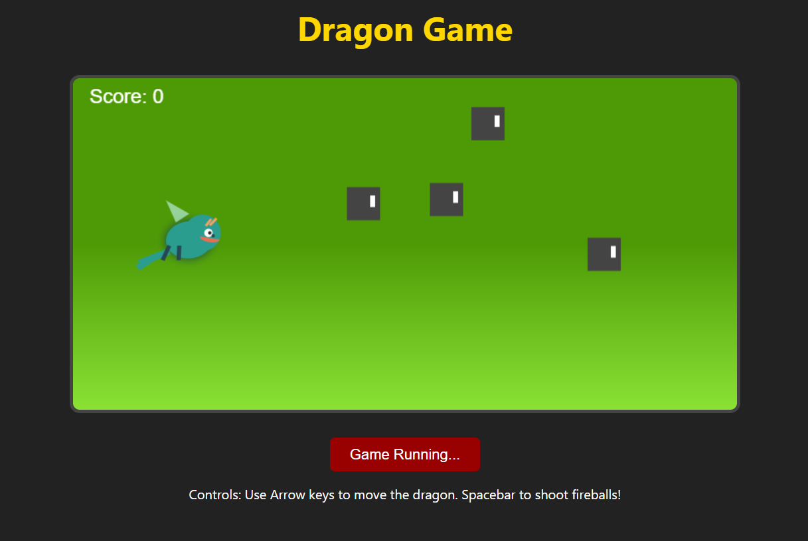

# 🐉 Dragon Game

A fun and interactive browser-based **Dragon Game** built using **HTML**, **CSS**, and **JavaScript**.

## 🚀 Live Demo
🔗 [Play the Game](dragongamebyfaizan.netlify.app)  

## 📸 Screenshot
  

## 🎮 Features
- Control a dragon using the arrow keys.
- Shoot fireballs with the spacebar.
- Avoid obstacles to survive and increase your score.
- Colorful visuals with a live score counter.

## 🕹️ How to Play
1. Open `index.html` in a browser or use the live demo link.
2. Click the **Start Game** button.
3. Use the controls:
   - ⬆️ **Up Arrow** – Move up  
   - ⬇️ **Down Arrow** – Move down  
   - 🔥 **Spacebar** – Shoot fireballs  
4. Survive as long as possible while avoiding obstacles and scoring points!

## 📁 Project Structure
├── index.html # Main HTML file
├── style.css # CSS styling
├── script.js # Game logic
├── screenshot.png # Game screenshot
└── README.md # Project documentation

## 🛠️ Customization Ideas
- Add power-ups and multiple enemy types.
- Integrate background music and sound effects.
- Save high scores using local storage.
- Add mobile/touch controls for smartphones.

Feel free to use, modify, and distribute it!

---

